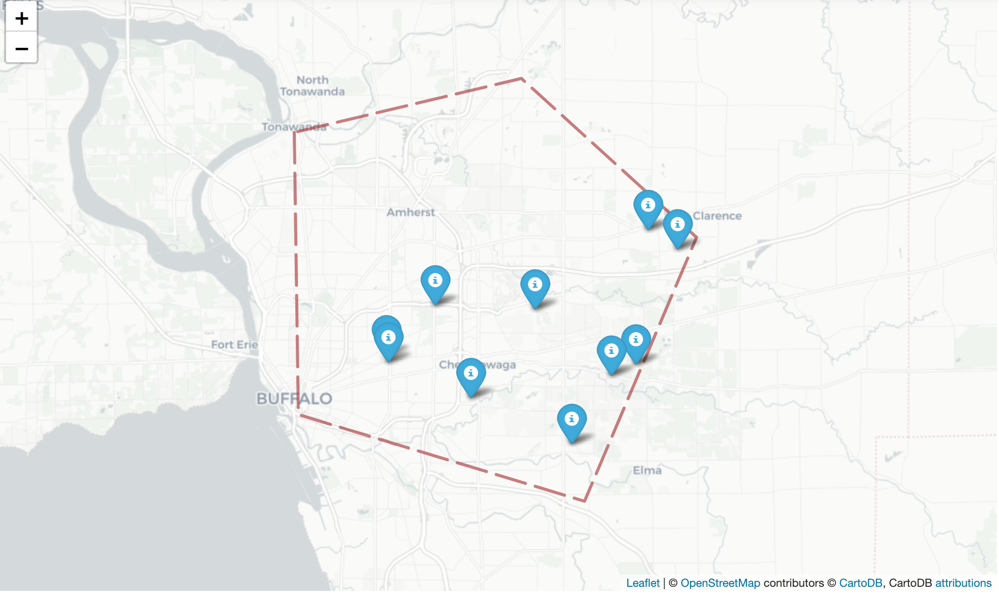
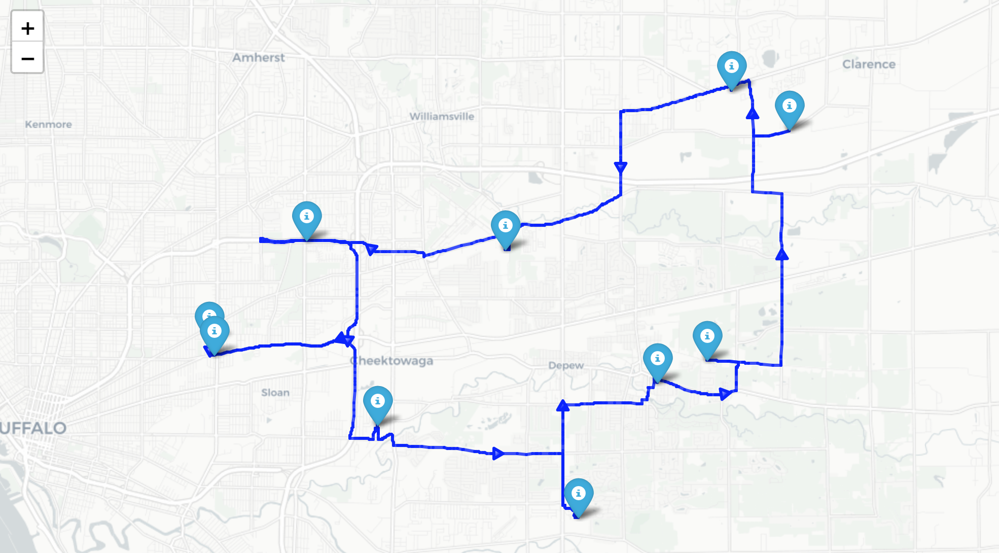
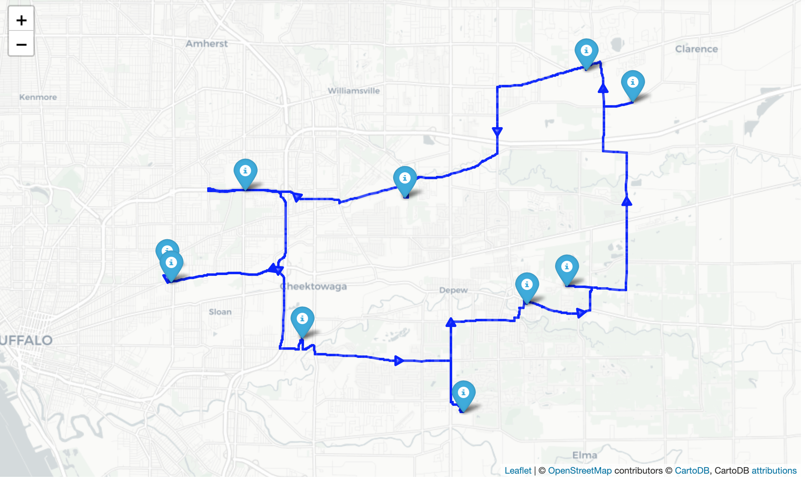

# Solved-TSP-using-Heuristics
Solved TSP (traveling salesperson problem) using Nearest Neighbor and Simulated Annealing Method

The solveTSP SA(nodesDF, costDict, timeLimit) function accepts three (3) inputs,in the following order:

(a) nodesDF { A VeRoViz "nodes" dataframe containing n locations, numbered 1 through n.
The TSP solution should visit each customer.
Location 1 is assumed as  the "home" location.}

 Documentation on the dataframe structure may be found at https://veroviz.org/docs/nodes.html.

(b) costDict { A VeRoViz "time" dictionary describing either the travel time, in [seconds],or the travel distance, in [meter], from each node to every other node. 
The contents of costDict will be generated by the VeRoViz getTimeDist2D() function (recall that this is an input to your function,so no need to calculate this dictionary). 
The travel time values will be generated using the \ORS-online" dataProvider.}

 Documentation on the "time" dictionary may be found at https://veroviz.org/docs/veroviz.getTimeDist2D.html.

 Documentation on the "ORS-online" dataprovider may be found at https://veroviz.org/docs/dataproviders.html.

(c) timeLimit { A scalar value describing the maximum runtime of your heuristic, in units of [seconds].
The solveTSP SA() function return a VeRoViz "assignments" dataframe, as described here: https://veroviz.org/docs/assignments.html.}

Following assumptions were made when solving problem (and creating your "assignments" dataframe):
(a) There is no service time at the nodes (i.e., the salesperson doesn't spend any time at
any of the nodes; she simply visits each location instantaneously).
(b) The salesperson must follow the road network, as determined by the "ORS-online" dataProvider.

 Register for an API key from openrouteservice, https://openrouteservice.org/dev/#/signup.

## Input:-Nodes Coodinates

## Output Results

TSP route for minimum time (in sec) between nodes

TSP route for minimum distance(in m) between nodes

The above results are identical because for a constant/particular speed distance is directly propotional to time 
